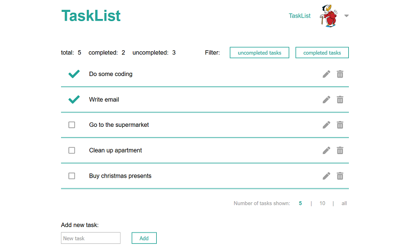

# TaskList
In this project I built a task manager. To use the task manager the user needs to create an account, so all tasks are user specific and a task can only be viewed or modified by the user who created it.
The tasks are stored in a database using MongoDB, so they are persisted even if the user logs out and starts a new session.

The motiviation for this project is to practice creation of a web application that is connected to a database, creation of a REST API and building of a web application using React.

## Screenshots

## Technologies
* JavaScript
* React
* Node.js
* Express
* NoSQL - MongoDB

## Functionalities
#### User registration
Before using the task manager the user has to register with his name and email address. Additionally, he has to set a password.
#### User login
Before using the task manager the user has to login with his email and password.
#### Profile management
User can manage his profile information, incl. adding a profile picture and changing name, email address and password
#### Task management
User can perform the following action to manage his tasks:
* add new task
* check task, when task completed
* edit task
* delete task
* sort tasks (e.g. only show unchecked tasks)
* pagination (show a certain number of tasks per page
#### User logout
User can logout of his account
#### User authentification
There is a token generated when a user logs in. User can perform task management actions only with a valid token.
As each user has his own account, all tasks in the task manager are linked to a certain user, so a certain task can only be modified by the user who created it.
#### Password encryption
Passwords which are stored in the database are encrypted.

## Further development ideas
* Add more possibilities to the sorting functionality
* Add possibility to create more than one task list per user
* Improve pagination behaviour

## Node.js environment variables
* PORT
* JWT_SECRET
* MONGODB_URL
